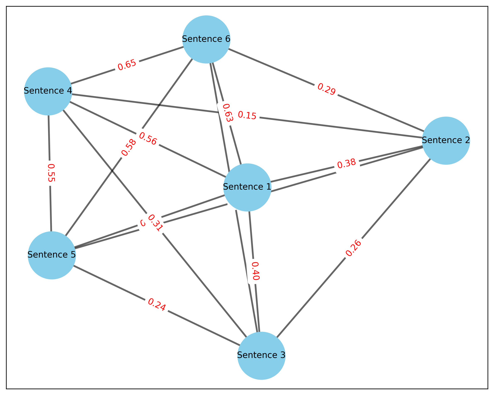

# Sentence Similarity Graph Embedding

This project demonstrates how to create and visualize a graph based on the semantic similarity of sentences about climate change. The sentences are represented as nodes in the graph, and edges are formed between nodes based on the similarity of the sentence embeddings.

## Table of Contents

- [Introduction](#introduction)
- [Installation](#installation)
- [Usage](#usage)
- [Visualization](#visualization)
- [Dependencies](#dependencies)
- [License](#license)

## Introduction

This project showcases how to:
1. Convert sentences into embeddings using a pre-trained model.
2. Construct a graph where nodes represent sentences and edges represent the similarity between them.
3. Generate graph embeddings using Node2Vec.
4. Visualize the graph to understand the relationships between sentences.

## Installation

To run this project, you'll need to have Python installed along with the required packages. You can install the dependencies using pip:

```bash
pip install sentence-transformers networkx node2vec matplotlib
```

# Usage

Clone the repository:

```bash
git clone https://github.com/yourusername/sentence-similarity-graph.git
cd sentence-similarity-graph
python sentence_similarity_graph.py
```

This will generate sentence embeddings, create a similarity graph, and display a visualization of the graph.

## Visualization



The graph visualization shows:

- **Nodes**: Each node represents a sentence.
- **Edges**: Edges are drawn between nodes based on the cosine similarity of the sentence embeddings. The thickness and color of the edges indicate the strength of the similarity.
- **Edge Labels**: The edges are labeled with the similarity score between the connected sentences.

## Example Graph

## Dependencies

- **sentence-transformers**: For generating sentence embeddings.
- **networkx**: For creating and handling the graph.
- **node2vec**: For generating graph embeddings.
- **matplotlib**: For visualizing the graph.

## License
This project is licensed under the MIT License - see the LICENSE file for details.